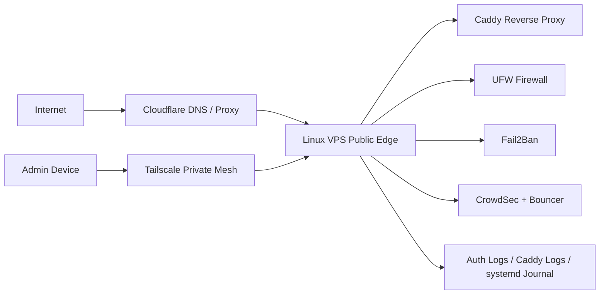

# External VPS Linux Hardening

## Overview

This project documents the hardening process for a public-facing Linux VPS used as an external edge system for self-hosted services, reverse proxying, private access, and security monitoring.

The goal of this project is to show practical blue-team and infrastructure-security work: reducing attack surface, hardening SSH, configuring firewall rules, reviewing authentication logs, deploying automated blocking tools, and documenting findings in a professional format.

> **Note:** All public IP addresses, private IP addresses, usernames, hostnames, and sensitive details should be sanitized before publishing.

---

## Project Goals

- Reduce unnecessary public exposure
- Harden SSH access
- Use firewall rules to allow only required services
- Use Fail2Ban and CrowdSec to respond to repeated malicious traffic
- Use Tailscale for private administrative access
- Use Caddy as a reverse proxy with automatic HTTPS
- Use Cloudflare DNS/proxying for public-facing subdomains
- Review authentication logs for brute-force behavior
- Document findings, lessons learned, and future improvements

---

## Environment

| Component | Purpose |
|---|---|
| Linux VPS | Public-facing external server |
| Caddy | Reverse proxy and HTTPS management |
| Cloudflare | DNS/proxying/protection for public subdomains |
| Tailscale | Private mesh access for admin and homelab connectivity |
| UFW | Host firewall |
| Fail2Ban | SSH brute-force protection |
| CrowdSec | Behavioral threat detection and firewall bouncer |
| systemd | Service management |
| journalctl/auth logs | Log review and investigation |

---

## Architecture



---

## Repository Structure

```text
external-vps-linux-hardening/
├── README.md
├── SECURITY.md
├── docs/
│   ├── 01-environment.md
│   ├── 02-hardening-checklist.md
│   ├── 03-ssh-hardening.md
│   ├── 04-firewall-ufw.md
│   ├── 05-fail2ban.md
│   ├── 06-crowdsec.md
│   ├── 07-caddy-cloudflare.md
│   ├── 08-tailscale-access.md
│   ├── 09-log-review-case-study.md
│   └── 10-lessons-learned.md
└── evidence/
    ├── commands-used.md
    └── sanitized-auth-log-example.txt
```

---

## Hardening Summary

| Control | Status | Notes |
|---|---:|---|
| System updates applied | Completed | Kept base system current |
| SSH root login disabled | Completed / verify | Confirm with `sshd -T` |
| SSH key authentication preferred | Completed / verify | Password login should be disabled once keys are confirmed |
| UFW enabled | Completed | Only required ports should be exposed |
| Fail2Ban enabled for SSH | Completed | SSH jail monitors repeated failures |
| CrowdSec installed | Completed | Used with firewall bouncer |
| Caddy reverse proxy | Completed | Handles HTTPS and routes public subdomains |
| Cloudflare DNS/proxying | Completed | Used in front of public services |
| Tailscale private access | Completed | Used for private mesh connectivity |
| Log review process | Completed | Reviewed SSH authentication attempts and bans |
| SSH restricted to Tailscale only | Planned / verify | Recommended future improvement if not already enforced |

---

## Sample Findings

### Finding 001: Repeated SSH Login Attempts

**Severity:** Medium  
**Category:** Brute-force activity  
**Source:** SSH authentication logs  

Repeated SSH login attempts were observed from external IP addresses using common usernames such as `admin`, `guest`, `ubuntu`, and other invalid users. This behavior is consistent with automated internet scanning and brute-force attempts.

**Response actions:**

- Verified no successful login occurred
- Confirmed Fail2Ban SSH jail was active
- Reviewed CrowdSec activity
- Reviewed firewall exposure
- Recommended key-based authentication and disabling password-based SSH login
- Recommended limiting SSH access to Tailscale where possible

---

## Skills Demonstrated

- Linux server administration
- SSH hardening
- Firewall configuration
- Log review
- Brute-force detection
- Fail2Ban configuration
- CrowdSec deployment
- Reverse proxy basics
- DNS/proxying with Cloudflare
- Tailscale private access
- Documentation and risk communication

---

## Lessons Learned

A public VPS receives constant automated scanning. Even a lightly used server should be treated as an internet-facing security boundary. Reducing exposed services, hardening SSH, using automated blocking tools, and regularly reviewing logs all help lower risk.

This project also reinforced the importance of documenting security work in a way that another technical person could understand and repeat.
