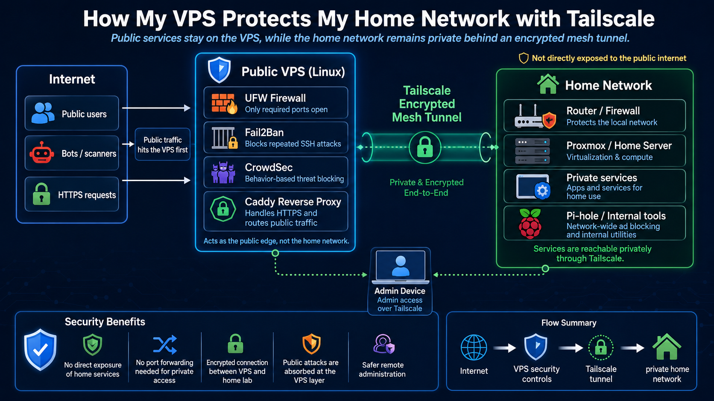

# 08 - Tailscale Private Access

## Objective

Use Tailscale to provide private administrative access between trusted devices and the VPS.

## Why Tailscale Helps

Tailscale allows private access without exposing every administrative service directly to the internet.

## Useful Commands

```bash
tailscale status
tailscale ip -4
sudo systemctl status tailscaled
```

## Security Use Cases

- Private SSH access
- Private dashboard access
- VPS-to-homelab connectivity
- Reduced public exposure
- Safer administrative workflows



## Recommended Future State

Where possible, administrative services should listen only on local or Tailscale interfaces. Public access should be reserved for services that truly need it.


